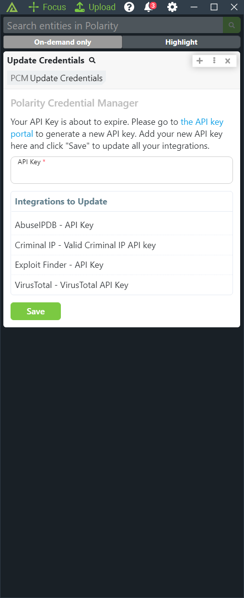

# Polarity Credential Manager

This is a proof-of-concept integration for managing a shared API key across multiple integrations.  The integration works by having a single API key option.  When searches are triggered, the integration will check if the API key is expiring (via the `isCredentialExpiring` method defined in `src/is-credential-expiring.js`).  If the API key is expiring, the integration will display a result to the user that lets the user input a new API key value.  The integration will then update all managed integration options with the new API key value.

|    |         |
|------------------------------------|--------------------------------------|
| *Configure integrations to manage* | *Update options from Overlay Window* |

## Polarity Credential Manager Integration Options

## Configuration Mode
If checked, the integration will allow an admin to configure the "Configuration" option via the Overlay Window

## User API Key
This is the API key used by all of your integrations. This option should not be directly updated. You will be asked to update the API key as needed via the Overlay Window.

## Configuration
JSON Configuration for the Polarity Credential Manager integration. Should not generally be updated manually.

## Installation Instructions

Installation instructions for integrations are provided on the [PolarityIO GitHub Page](https://polarityio.github.io/).

## Polarity

Polarity is a memory-augmentation platform that improves and accelerates analyst decision making. For more information about the Polarity platform please see:

https://polarity.io/
